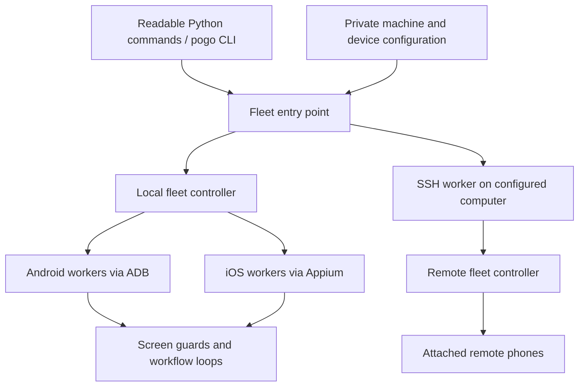

# Architecture

The public interface names each user task. The fleet layer chooses computers and devices. Platform workers implement the actual screen interactions.

## Entry points

The readable entry files delegate to the existing fleet interface; compatibility files retain familiar commands. Keep argument handling here small. A new workflow should expose selection, a bounded run, and a plan/check path before introducing automation loops.

## Coordination

`sources/fleet_entrypoint.py` handles public invocation and configured computer delegation. `sources/pokemon_fleet.py` loads fleet profiles, resolves devices, validates capability and readiness, and launches the appropriate worker. Worker invocations must not fan out again.

The same alias and configuration must mean the same intended device throughout planning and execution. Explicitly requested unavailable devices should produce useful errors. When selecting all devices, read the reported skips; “all” cannot connect a physically absent phone.

## Platform workers

Android workers use ADB for discovery, screen capture, and input. iOS workers use Appium/WebDriverAgent and workflow profiles. Shared detection, strategy, recovery, and cleanup modules keep behavior consistent across entry points.

The refactor preserves the existing workers rather than replacing their battle, gift, and trade algorithms. The [file reference](file-reference.md) identifies where each implementation lives.

## Configuration and state

`sources/config_paths.py` centralizes configuration resolution. Installation-specific information comes from private files outside the checkout. Public templates communicate the schema without encoding a real operator's fleet.

Run state has a different lifetime from source code. Histories, device locks, screenshots, and reports should remain local and private. A release should consist of source, generic examples, documentation, and synthetic tests.

## Extending a workflow

1. Start at its public entry point and follow the fleet dispatch to its platform worker.
2. Identify the expected screen states and the condition that advances each state.
3. Put new installation-specific settings in the private configuration schema and generic template.
4. Add focused tests for logic, dispatch, and failure behavior.
5. Validate discovery and a plan on the real configured computers.
6. Run a small supervised action only when authorized and document its actual result.
